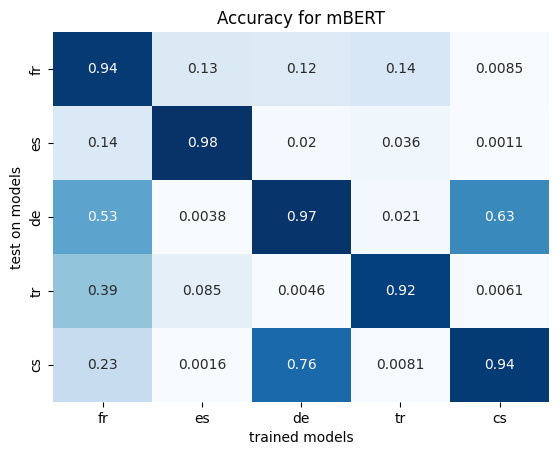

# Fine-tune mBERT

This was a university project. It was designed to fine-tune pre-trained models with the HuggingFace API. We fine-tuned the mBERT model on PoS tagging for different languages. 
 
 
The corpus we used is a Universal Dependencies corpus. As this formal is already pre-tokenized, the pre_treatment.py file contains functions to read and "normalize" the PoS taggs as well as to align the UD tokens with the tokens form the mBERT tokenizer. 
 
 
That step done, the fine_tuning.py file contains functions to fine-tune and evaluate the model. Once training completed, the model is evaluated on 5 different languages. I fine-tuned the model on five different languages and tested it on the same languages. Here are my test results: 

The blue diagonal shows more than 90 % accuracy for models used with the language they were fine-tuned on. When used with another language, the models performance decreases drastically. Only the model trained on German und used with Czech and vice versa still achieves around 60 % accuracy. Another interesting fact is the model fine-tuned on French language which shows 50 % accuracy when used for German. However, the German fine-tuned model shows less than 15 % accuracy when used for French. 
